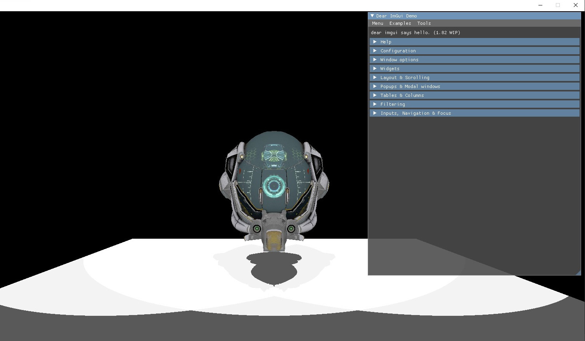

### A basic real time renderer using the Vulkan API.  
It uses a basic scene graph approach where each object can be a empty node, a 3D model or a light.
At render time these objects get collected, loaded into the GPU and drawn, then they are unloaded when they are not needed.  

Each light causes a redraw of the whole scene to fill the shadowmaps, then all the shadowmaps get used to draw the final scene.
This final image gets then fed into a compute pipeline that does some basic post-processing (currently only gamma-correction).  

To draw the objects from the point of view of the lights push constants are used to upload the 
view matrix and the projection matrix effectively treating the light like a camera. 

Every object material is represented by a Vulkan pipeline that gets created with every material loaded into
the renderer, this pipeline is then used when drawing the object. The geometry and the indices for a single model are 
stored in a single normal Vulkan buffer and handled using offsets.

The data oriented handling of the objects owned by the renderer allows to create and update 
the massive amount of vulkan resources in bulk to avoid many small calls.

The image before it has been fed into the compute pipeline for the gamma correction.
